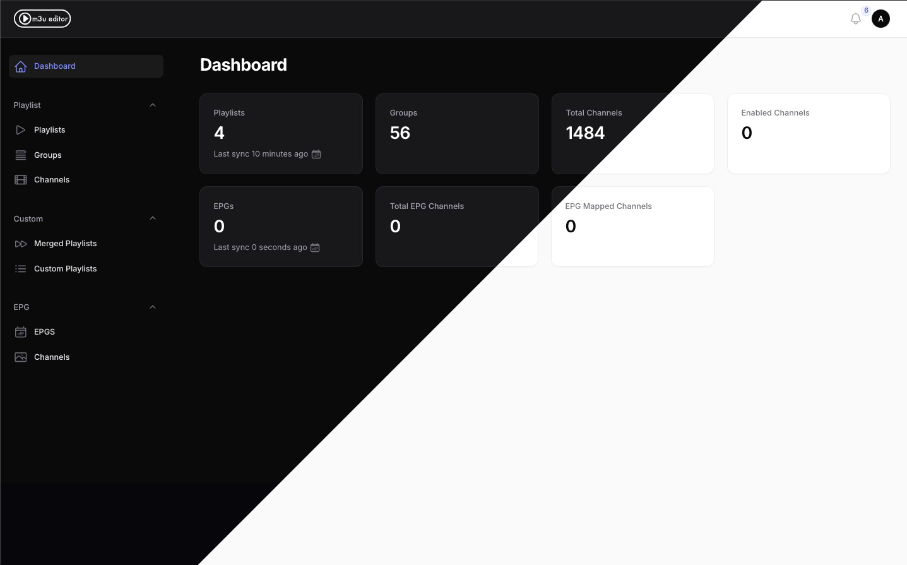
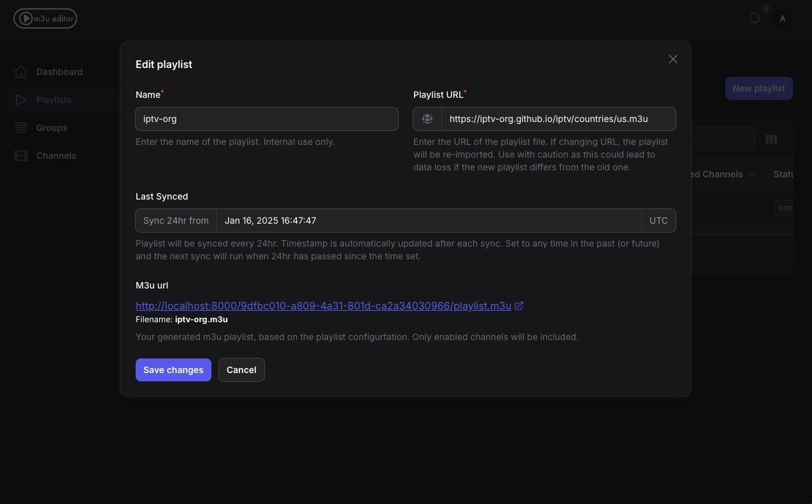
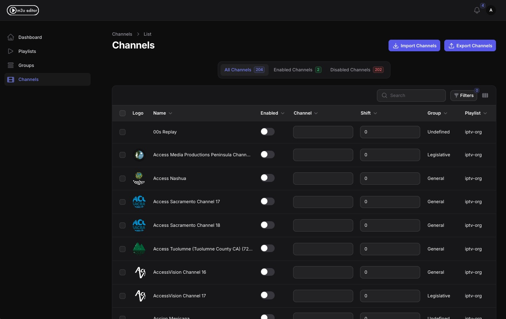

# m3u editor

A simple `m3u` playlist editor, similar to **xteve** or **threadfin**. 
As of now, there are no plans for EPG integration, but if there's enough interest this can be looked into.

> [!NOTE]  
> Has been tested on large playlists up to 4000 channels, which should cover most cases.

Ability to merge playlists is not currently available, but could be fairly easily added if there are enough requests for this feature.

## How It Works
1. Initialization and M3U Playlist(s) creation:
    - The service loads M3U playlist from specified URL, downloading and processing it.
    - Each playlist will have a unique URL to output enabled channels and any customizations
    - Only enabled channels will be returned.
2. Automatic playlist(s) sync:
    - Playlist sync happens upon creation, and every 24hr after. The schedule can be adjusted after playlist is created.
3. HTTP endpoints:
    - The app can be accessed here: [http://localhost:36400](http://localhost:36400)
    - Each playlist will have a unique URL, in the format: `http://localhost:36400/9dfbc010-a809-4a31-801d-ca2a34030966/playlist.m3u`
4. Customization:
    - Modify M3U channel numbers and offset. Channels are opt-in, so **all channels will be disabled by default** and need to be enabled based on your preference. This is to prevent channel additions automatically populating your playlist.

## Prerequisites
- [Docker](https://www.docker.com/) installed on your system.
- M3U URLs containing a playlist of video streams.

## Screenshots

### Dashboard



### Playlist editor



### Channel management



## 🐳 Docker compose

Use the following compose example to get up and running.

```yaml
version: "3.8"
services:
  m3u-editor:
    image: sparkison/m3u-editor:latest
    container_name: m3u-editor
    network_mode: host
    environment:
      - PUID=1000
      - PGID=1000
      - TZ=Etc/UTC
      - WWWUSER=sail
      - LARAVEL_SAIL=1
      - XDEBUG_MODE=off
    volumes:
      - /apps/m3ueditor/config:/var/www/config
    restart: unless-stopped
    ports:
      - 36400:36400 # app
      # - 36790:36790 # for queue (redis server) - not currently used
      - 36800:36800 # websockets/broadcasting
networks: {}

```

Access via: [http://localhost:36400](http://localhost:36400)

To ensure the data is saved across builds, link an empty volume to: `/var/www/config` within the container. This is where the `env` file will be stored, along with the sqlite database and the application log files.

> [!NOTE]  
> Once built, head to the `env` file with your linked config directory and make sure the `REVERB_HOST` is properly set to the machine IP (if not `localhost`) for websockets and broadcasting to work correctly. This is not required for the app to function, but you will not receive in-app notifications without it. You will need to restart the container after changing this.

### 📡 (Optionally) creating a playlist proxy

Using the [M3U Stream Merger Proxy](https://github.com/sonroyaalmerol/m3u-stream-merger-proxy) as an example.

```yaml
version: "3.8"
services:
  m3u-proxy:
    image: sonroyaalmerol/m3u-stream-merger-proxy:latest
    container_name: m3u-proxy
    network_mode: host
    environment:
      - PUID=1000
      - PGID=1000
      - TZ=Etc/UTC
      - PORT=7001
      - DEBUG=true
      - SYNC_ON_BOOT=true
      - SYNC_CRON=0 0 * * *
      - M3U_URL_1=http://192.168.0.1:36400/[PLAYLIST_UID]/playlist.m3u
      - M3U_MAX_CONCURRENCY_1=5
      #- M3U_URL_2=https://iptvprovider2.com/playlist.m3u
      #- M3U_MAX_CONCURRENCY_2=1
      #- M3U_URL_X=
    volumes:
      # [OPTIONAL] Cache persistence: This will allow you to reuse the M3U cache across container recreates.
      - /apps/m3u-proxy:/m3u-proxy/data
    restart: unless-stopped
    ports:
      - 7001:7001
networks: {}

```

Your proxied m3u playlist can then be access via: [http://192.168.0.1:7001/playlist.m3u](http://192.168.0.1:7001/playlist.m3u)

More setup information can be found on the [M3U Stream Merger Proxy](https://github.com/sonroyaalmerol/m3u-stream-merger-proxy) page.
