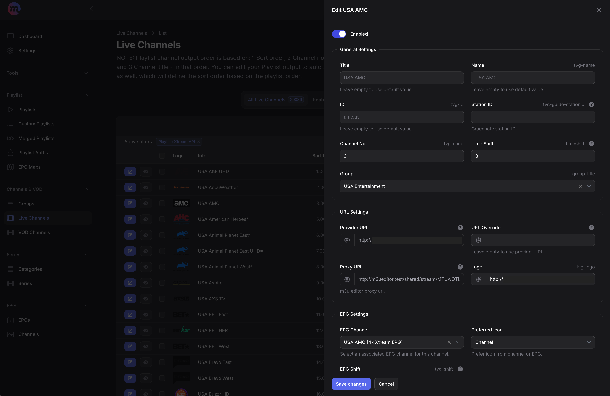
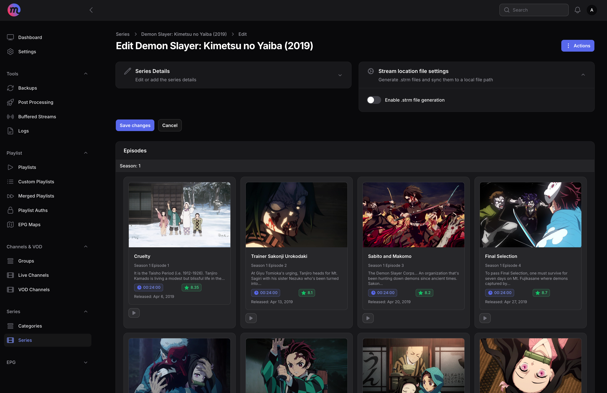
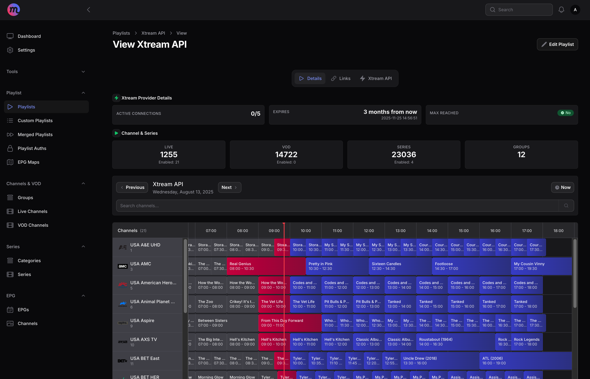
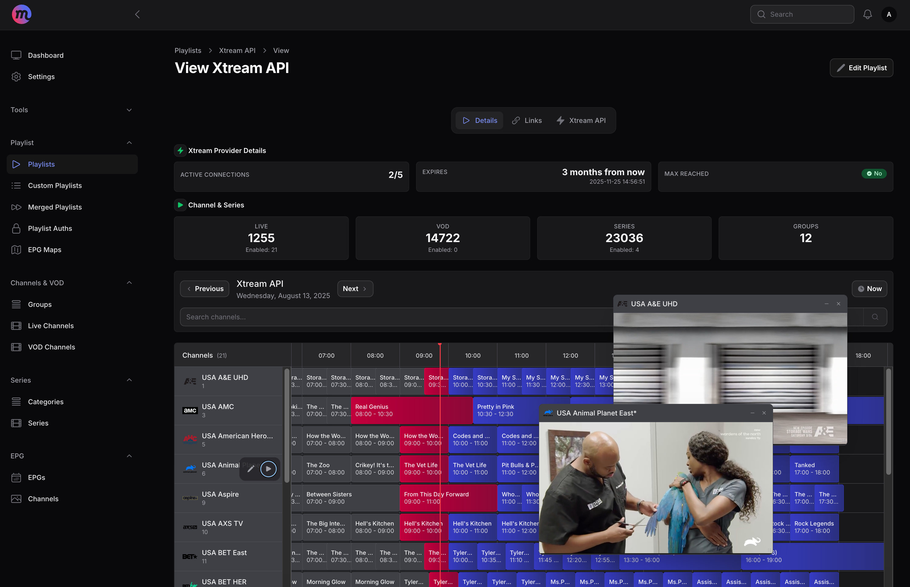
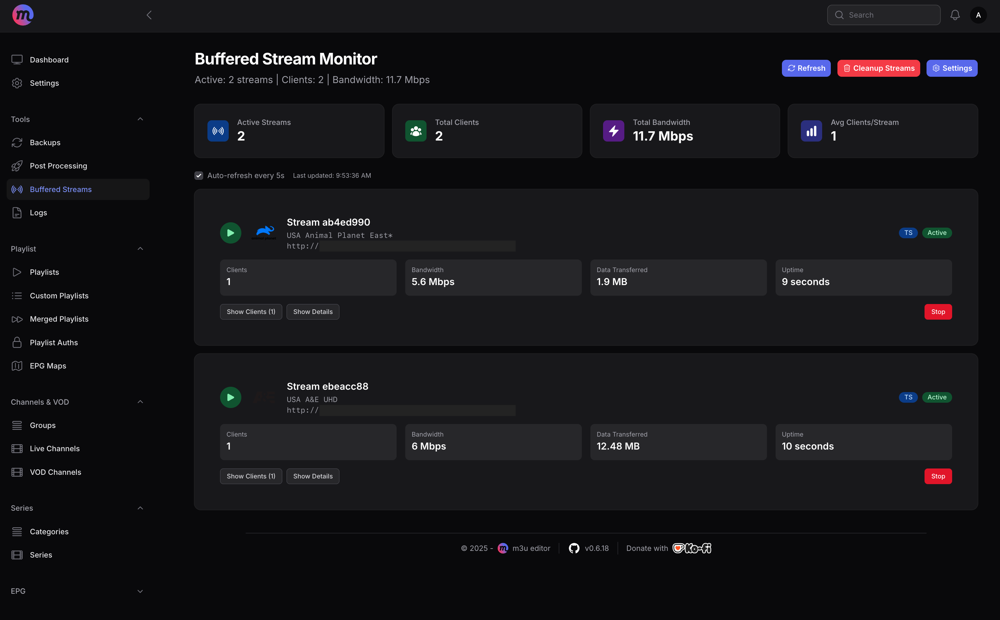

# m3u editor

A full-featured and powerful `IPTV` editor, including features similar to **xteve** or **threadfin**. Also includes full `EPG` management, full Xtream API output, series management with ability to store and sync .strm files, post processing with ability to call custom scripts, send webhook requests, or send an email, and much more!

Works with m3u, m3u8, m3u+ and Xtream codes api!

EPG support for XMLTV files (local or remote), XMLTV URLs, and full **Schedules Direct** integration.

### Questions/issues/suggestions

Feel free to [open an issue](https://github.com/sparkison/m3u-editor/issues/new?template=bug_report.md) on this repo, or hit us up on [Discord](https://discord.gg/rS3abJ5dz7)

### Join us on Discord

Join our [Discord](https://discord.gg/rS3abJ5dz7) server to ask questions and get help, help others, suggest new ideas, and offer suggestions for improvements! You can also try out and help test new features! 🎉

## Prerequisites

- [Docker](https://www.docker.com/) installed on your system.
- Xtream codes API login info or M3U URLs/files containing an M3U playlist of video streams.
- (Optionally) EPG URLs/files containing valid XMLTV data.

## 📖 Documentation

Check out the docs: [m3u editor docs](https://sparkison.github.io/m3u-editor-docs/) (we could use some help with this one...)

## 🐳 Docker quick start

| Use Case                    | File                                                    | Description                                                                                            |
| --------------------------- | ------------------------------------------------------- | ------------------------------------------------------------------------------------------------------ |
| **All-in-One Deployment**   | [docker-compose.aio.yml](./docker-compose.aio.yml) | A simple, all-in-one solution — everything runs in a single container for quick setup. Hardware acceleration is not supported in this setup.  |
| **Modular Deployment**      | [docker-compose.proxy.yml](./docker-compose.proxy.yml)         | ⭐ Recommended! Separate containers for **m3u-editor**, **m3u-proxy** (_the external proxy setup is required for hardware acceleration_), and **Redis** — perfect if you want more granular control. Postgres can be easily added as a seperate container as well. |
| **Modular + VPN** | [docker-compose.proxy-vpn](./docker-compose.proxy-vpn.yml) | Example of modular deployment using Gluetun VPN.          |

View more in our [getting started](https://sparkison.github.io/m3u-editor-docs/docs/about/getting-started/) docs to get up and running in minutes! 🥳

---

## 📸 Screenshots

---

## 🤝 Want to Contribute?

> Whether it’s writing docs, squashing bugs, or building new features, your contribution matters! ❤️

We welcome **PRs, issues, ideas, and suggestions**!\
Here’s how you can join the party:

- Follow our coding style and best practices.
- Be respectful, helpful, and open-minded.
- Respect the **CC BY-NC-SA license**.

---

## ⚖️ License  

> m3u editor is licensed under **CC BY-NC-SA 4.0**:  

- **BY**: Give credit where credit’s due.  
- **NC**: No commercial use.  
- **SA**: Share alike if you remix.  

For full license details, see [LICENSE](https://creativecommons.org/licenses/by-nc-sa/4.0/).
